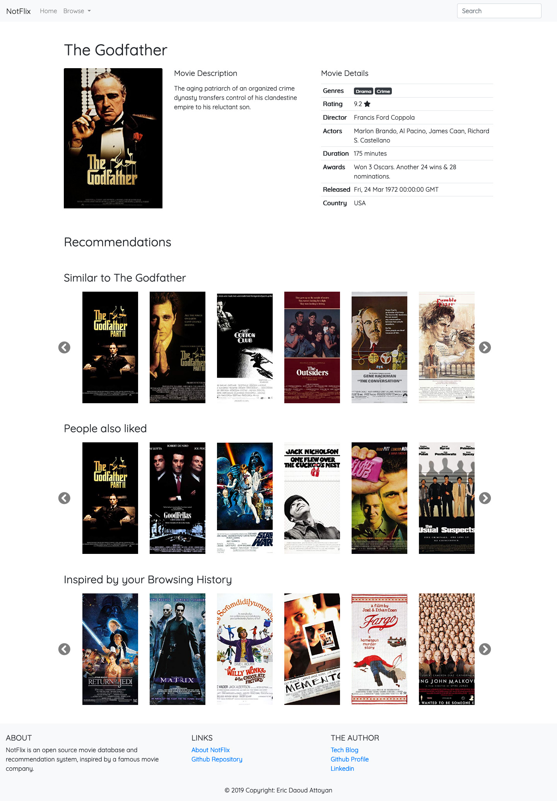

# NotFlix

[](https://notflix.readthedocs.io/en/latest/?badge=latest)
[](https://circleci.com/gh/ericdaat/notflix)

## About

This is Notflix, a free movie database and recommendation website.

This website is simply a side project, that aims at displaying a fixed dataset
of movies and provide recommendations about other movies to watch.
I am building it mostly for fun and also to have a nice playground to
implement various recommendation algorithms using Machine Learning.

NotFlix is based on data from the following sources:

* [OMDB](http://www.omdbapi.com/): The Open Movie DataBase
* [Grouplens' MovieLens](https://grouplens.org/datasets/movielens/):
    Datasets behind [MovieLens](https://movielens.org/) project.

## Installation

Pre-requisite:

1. Install the following software:

    * [Docker](https://www.docker.com/get-started)
    * [docker-compose](https://docs.docker.com/compose/)
    * [Python 3](https://www.python.org/downloads/)
    * [virtualenv](https://virtualenv.pypa.io/en/latest/)

2. Download the movielens data:

    * Download the `ml-1m dataset` by clicking [here](http://files.grouplens.org/datasets/movielens/ml-1m.zip)
    * Unzip it and place it under `datasets/movielens/ml-1m`

3. To add the movie metadata to the downloaded dataset
    (such as the actors, ...) I chose to use the
    [OMDb API](http://www.omdbapi.com/) (the Open Movie Database).
    Support him on [Patreon](https://www.patreon.com/omdb) and get
    a key that you will place in a text file called `omdb.key` at the
    root of this repository

Once you have all the pre-requisite set up, follow these steps:

1. Copy the [db-credentials.env](db-credentials.env.dist) template and add the credentials you want:

    ``` text
    cp -n db-credentials.env.dist db-credentials.env;
    ```

2. Create a virtual environment and install the required packages:

    ``` text
    virtualenv venv;
    source venv/bin/activate;
    pip install -r requirements.txt;
    ```

3. Build the Docker images:

    ``` text
    docker-compose build;
    ```

4. Launch the PostgreSQL database:

    ``` text
    docker-compose up -d postgres
    ```

5. Use the following flask-cli commands to insert the data into the DB:

    ``` text
    export FLASK_APP="src/web";
    export POSTGRES_HOST="127.0.0.1";

    flask init-db;
    flask insert-engines;
    flask insert-pages;
    flask download-movies;
    flask insert-movies;
    flask train-engines;
    flask upload-engines;
    ```

6. Launch the application with `make start` and then visit
    `localhost:5000`.

## Usage

So far, Notflix exposes the following pages:

* A **home page**, displaying the popular movies, the user browsing history
    and some personalized recommendations.
* A **movie page**, displaying basic informations about the selected movie
    and recommendations on similar movies to watch.
* A **genres** page, that lets you browse movies by genres.
* A **search** page, that lets you search the movies.

The configuration for engines and pages is handled with the [display.json](./display.json) file. You can use it to change
the engines displayed, their names and order on the page.

## Repository organization

The repository is organized the following way:

* [.circleci](.circleci): Configuration file for CircleCI
* [datasets](./datasets): Folder containing the datasets
    (so far only movielens)
* [docs](./docs): Folder containing the documentation, auto-generated
    by [Sphinx](http://www.sphinx-doc.org/en/master/).
* [logs](./logs): Logs file are saved here
* [models](./models): Machine Learning models are saved here.
  * Under [bin](./models/bin) we save the models weights.
  * Under [csv](./models/csv) we save CSV files containing the predictions
    made by a given engine.
* [notebooks](./notebooks): The exploratory [Jupyter](https://jupyter.org/) notebooks
* [src](./src): Source code
  * [api](./src/api): Flask API, responsible of computing the
    recommendations displayed on the web app.
  * [data_interface](./src/data_interface): Code for interacting with the
    cache or the database.
  * [recommender](./src/recommender): Everything related to
    computing recommendations.
  * [tracker](./src/tracker): Code for tracking the user events.
  * [utils](./src/utils): Various utility functions
  * [web](./src/web): Code for the Flask web application
* [tests](./tests): Unit test code

## Notes

* I am deliberately showing multiple engines on a web page to outline
    the different recommendations results from an algorithm to another.
* I am not removing the movie duplicates from an engine to another
    for the same reason than above.
* The Machine Learning algorithms are not very well trained yet, I spent
    some time working on the application to make it easy to add
    new engines later.

So far, the movie page looks like this:


